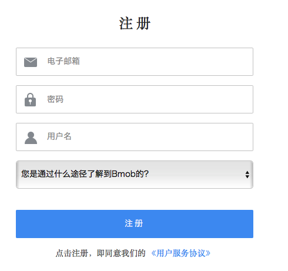
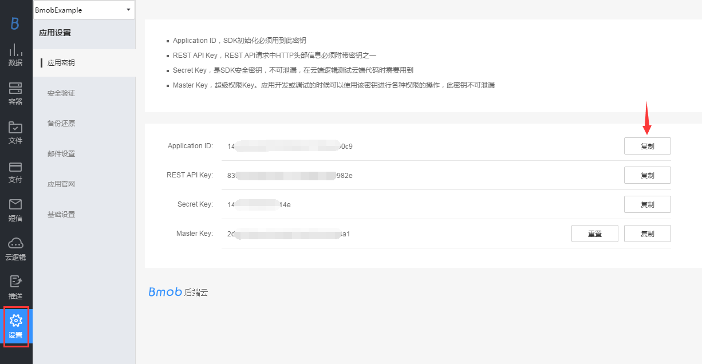
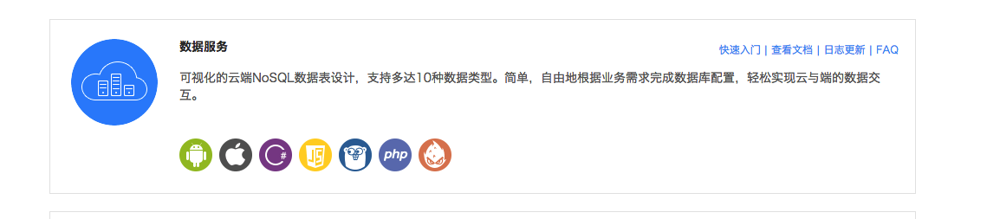

## 注册Bmob帐号
在网址栏输入www.bmob.cn或者在百度输入Bmob进行搜索，打开Bmob官网后，点击右上角的“注册”，在跳转页面填入你的姓名、邮箱、设置密码，确认后到你的邮箱激活Bmob账户，你就可以用Bmob轻松开发应用了。



## 网站后台创建应用

登录账号进入bmob后台后，点击后台界面左上角“创建应用”，在弹出框输入你应用的名称，然后确认，你就拥有了一个等待开发的应用。


## 获取应用密钥和下载SDK

选择你要开发的应用，进入该应用


在跳转页面，进入设置/应用密钥，点击复制，即可得到Application ID




获取Application ID后，下载SDK，开发者可以根据自己的需求选择相应的iOS SDK 或Android SDK，点击下载即可。



## 安装BmobSDK

### 直接添加类库方式使用BmobSDK

1)将BmobSDK引入项目:

在你的XCode项目工程中，添加BmobSDK.framework

2)添加使用的系统framework:

在你的XCode工程中Project ->TARGETS -> Build Phases->Link Binary With Libraries引入CoreLocation.framework、Security.framework、CoreGraphics.framework、MobileCoreServices.framework、CFNetwork.framework、CoreTelephony.framework、SystemConfiguration.framework、libz.1.2.5.tbd、libicucore.tbd、libsqlite3.tbd

### 使用CocoaPods安装BmobSDK

如何使用CocoaPods安装BmobSDK可查看我们提供的文档: [https://github.com/bmob/bmob-ios-sdk/blob/master/InstallCocoaPods.md](https://github.com/bmob/bmob-ios-sdk/blob/master/InstallCocoaPods.md)

### 创建桥连接头
在Swift的项目里引用OC的代码需要创建桥连接头，在项目里随意创建个.m文件,XCode就会自动创建 xxx-Bridging-Header.h，在此头文件添加
`#import <BmobSDK/Bmob.h>` 即可使用Bmob提供的服务。


## 设置应用的BmobKey
在你的XCode工程中的AppDelegate.m文件中创建应用Key，填入申请的授权Key（SDK使用的是应用密钥里的Application ID），示例如下：

```
func application(application: UIApplication, didFinishLaunchingWithOptions launchOptions: [NSObject: AnyObject]?) -> Bool {
        // Override point for customization after application launch.

        Bmob.registerWithAppKey("申请的Application ID")

        return true
    }
```


## 添加一行数据

```
    let gamescore:BmobObject = BmobObject(className: "GameScore")
    gamescore.setObject("小明", forKey: "playerName")
    gamescore.setObject(78, forKey: "score")
    gamescore.setObject(true, forKey: "cheatMode")
    gamescore.saveInBackgroundWithResultBlock { (isSuccessful, error) in
        if error != nil{
            print("error is \(error.localizedDescription)")
        }else{
            print("save success")
        }
    }
```

## 获取一行数据

```
	//查找GameScore表
	let query:BmobQuery = BmobQuery(className: "GameScore");
	//查找GameScore表里面id为0c6db13c的数据
    query.getObjectInBackgroundWithId("0c6db13c") { (obj, error) in
    	  //表里有id为0c6db13c的数据
        if error != nil{

        }else{
        //得到playerName和cheatMode
            let playerName = obj.objectForKey("playerName") as? String
            let cheatMode = obj.objectForKey("cheatMode") as? Bool
            print("playerName is \(playerName) cheatMode is \(cheatMode)")
        }
    }
```

## 修改一行数据

```
	//查找GameScore表
    let query:BmobQuery = BmobQuery(className: "GameScore");
    //查找GameScore表里面id为0c6db13c的数据
    query.getObjectInBackgroundWithId("0c6db13c") { (obj, error) in
        if error != nil{
            //进行错误处理
        }else{
            if obj != nil{
                let player = BmobObject(outDatatWithClassName: obj.className, objectId: obj.objectId)
                //设置cheatMode为false
                player.setObject(false, forKey: "cheatMode")
                //异步更新数据
                player.updateInBackground()
            }
        }
    }
```

## 删除一行数据

```
	//查找GameScore表
    let query:BmobQuery = BmobQuery(className: "GameScore");
    //查找GameScore表里面id为0c6db13c的数据
    query.getObjectInBackgroundWithId("0c6db13c") { (obj, error) in
        if error != nil{
            //进行错误处理
        }else{
            if obj != nil{
                //异步s删除数据
                obj.deleteInBackground()
            }
        }
    }
```

## 源码下载

[快速入门相关源码下载](https://github.com/bmob/bmob-ios-demo "快速入门相关源码下载")


案例教程和源码是快速入门的最简单方法，Bmob也为大家准备了相关的[案例教程和源码](http://docs.bmob.cn/ios/example/index.html?menukey=example_teach_doc&key=example_teach_ios)，欢迎大家下载和查看。

